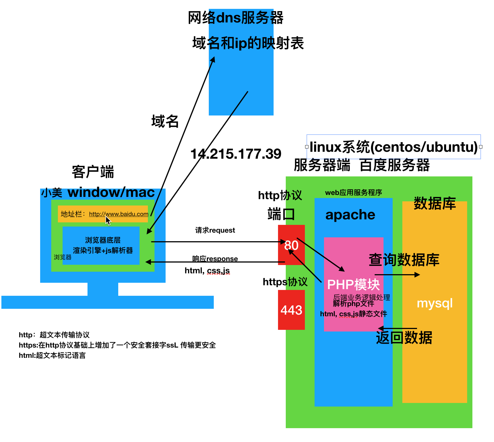

### Ajax课程

***

#### Ajax第一天

##### 准备工作

```
1. 服务器的搭建：
			 java---> tomcat
			 php ---> apache
			 python ---> gunicorn/uwisgi
			 服务器集成包---php相关
			 
       下载 php 的服务器集成包 （wamp，phpstudy，xamp...）
       集成包( web应用程序（apache）+ 后端语言php + 数据库mysql + phpmyadmin 数据库管理 软件 )
2. 服务器的启动
			apache mysql 启动
			
扩展：mac系统自带apache   路径：/etc/apache2/httpd.conf
sudo apachectl start/stop 启动mac自带apache
小小扩展：
lsof -i tcp:80 查看对应端口   kill pid 结束对应端口进程
/Library/WebServer/Documents 默认的网站根目录
LoadModule php7_module libexec/apache2/libphp7.so 在配置文件去掉# 开启php模块
```

##### 前后端基本通信以及主流架构演示



##### 什么是ajax ?

```
Asynchronous JavaScript and XML（异步JavaScript和XML) 
异步：不同于同步，是一个非阻塞的形式
xml(可扩展的标记语言)：前后端的数据交互格式（过去老的一种重量级格式 现在已经不用，现在主流用json：轻量级的数据交互格式）

	1.节省用户操作时间，提高用户体验，减少数据请求 （好处）
	2.传输获取数据 （作用）

```

##### ajax的应用场景

```python
1.用Ajax进行数据验证
	表单验证
2.按需取数据
	比如：部门结构，文档分类，三级省市区联动
3.自动更新页面
	比如：最新的热点新闻，天气预报以及聊天室内容 
```

##### 演示第一个ajax程序

> 使用ajax获取某一文本文件的内容

```
 var xhr = new XMLHttpRequest();

	xhr.open('get','aa.txt',true);

	xhr.send();

	xhr.onreadystatechange = function () {
		
		if(xhr.state == 4) {
			alert( xhr.responseText );
		}

	}
```


##### ajax创建过程解释以及兼容性处理

```JavaScript
用户行为: 第一步 打开浏览器 第二步 输入地址  第三步 按下回车（发送） 第四步 等待页面数据返回
实际过程：


IE6:ActiveXObject(‘Microsoft.XMLHTTP’)
```

```
var xhr = null;
if(window.XMLHttpRequest){
	xhr = new XMLHttpRequest()
}else {
	xhr = ActiveXObject(‘Microsoft.XMLHTTP’)
}

	xhr.open('get','aa.txt',true);

	xhr.send();

	xhr.onreadystatechange = function () {
		
		if(xhr.state == 4) {
			alert( xhr.responseText );
		}

	}
```


**try…catch语句**

```javascript
//异常捕获
//手动抛错
// ajax 使用try catch语句实现兼容
var xhr = null;
try{
	xhr = new XMLHttpRequest()
}catch(e) {
	xhr = ActiveXObject(‘Microsoft.XMLHTTP’)
}
```

##### open方法以及表单演示

```
open()
参数介绍：
1:请求方式 get /post
2:请求地址 './data.php  ./aa.txt' 
3:是否异步:true异步  false同步 （稍后说）
```


表单提交数据演示（get/post）

扩展

```
form表单提交数据  
    action: 请求的地址
    method： 什么方式请求后端
    enctype: 默认 application/x-www-form-urlencoded  将表单中的数据变为键值对的形式
            text/plain：纯文本
            multipart/form-data： 含有非文本内容 比如音频文件
作用：对数据进行编码，并通过请求头的方式告诉后端，发送的数据编码类型，方便后端接收到数据以后，进行对应的解码操作

```


```javascript
//get:
	1 把数据通过数据名称=数据值的方式连接起来 多组数据之间通过&的方式串联起来，把整体数据 放置到请求地址url的?后面
		http://www.baidu.com?username=aa&age=14&job=fe
	2 URL长度限制问题，并且只能传递字符串类型的数据，不能传输过多数据
	
	3 相对而言 get比post安全性更差一些 
//post：
  // 注册：	
	1.将数据串联起来之后 通过请求体中的formData中进行携带
	2.理论上无限制  (服务器端默认有一个限制 php.ini post_max_size=8M)
	3. 相对而言 post比get更安全一些 
```

##### 异步概念以及ajax异步存在的意义

```
open('请求方式get/post',请求地址，true)
异步：前面代码不会阻塞后面的代码运行
同步：前面代码会阻塞后面代码的运行

ajax 一般都是true 异步操作  提高用户体验 页面非阻塞  无刷新
```

##### 发送数据

```
Send方法
发送数据请求，相当于Form的submit
```


##### 等待返回响应的数据

```javascript
//请求状态监控
onreadystatechange事件  当准备状态发生改变的时候触发
	readyState属性：请求状态 ajax工作状态
		0	（初始化）还没有调用open()方法  （已经创建ajax对象）
		1	（载入）已调用open()方法，正在发送请求
		2	（载入完成）send()方法完成，已收到全部响应内容
		3	（解析）正在解析响应内容
		4	（完成）响应内容解析完成，可以在客户端调用了

status属性：服务器(请求资源)的状态，http状态码
返回的内容
	responseText：返回以文本形式存放的内容
	responseXML：返回XML形式的内容

```

##### 发送请求(get和post的区别)
* **get请求**

  ```
  问题：
  1.中文编码 encodeURI()
  2.缓存   给url后面添加时间戳
  ```

* **post方式**

  ```
  1.send(要发送的数据)
  2.POST：setRequestHeader(类型, 内容)：设置请求头
  	"Content-Type","application/x-www-form-urlencoded”
  3 没有缓存问题
  4 请求头中设置了文件编码类型，则没有中文乱码问题
  ```

  

##### 响应数据的处理以及JSON对象的使用

```
json：轻量级的前后端数据交互格式：
json格式的非常严格：
	1 键名和字符串必须有双引号引起来
	2 里面不能有注释
	3 {} 或者 [{},{},...]
	
	{
	"name":"张三",
	"age"：24
	...
	}
```


##### 获取新闻列表


##### 封装ajax请求—定时刷新

